<p align="center"><strong>English</strong> · <a href="README.zh-CN.md">简体中文</a></p>

<p align="center"></p>

<h1 align="center">TIKAZ Frontend Design for Codex</h1>
<p align="center"><strong>Art-directed frontend workflows that prove the visual direction before scaling implementation.</strong></p>
<p align="center"><a href="https://github.com/TIKAZI/TIKAZ-Codex-Frontend-Design/actions/workflows/validate.yml"></a> <a href="LICENSE"></a> </p>
<p align="center"><a href="https://github.com/TIKAZI/TIKAZ-AI-Skills">← Explore all seven TIKAZ AI Skills for Codex suites</a></p>

---

## ✨ One suite, ready to install

This repository is the independently installable **frontend-design** distribution from [TIKAZ AI Skills for Codex](https://github.com/TIKAZI/TIKAZ-AI-Skills). The monorepo is the canonical development source; this repository is automatically synchronized and optimized for people who need only this workflow.

Designed, integrated, refactored, and continuously maintained by **TIKAZ**; community contributions are welcome. This is an independent project, not an OpenAI-official repository.

This repository is an automatically synchronized distribution of the canonical [TIKAZ-AI-Skills](https://github.com/TIKAZI/TIKAZ-AI-Skills) monorepo. Cross-suite issues and source changes belong in the canonical repository.

## 🧩 What makes it different

- **Four product-surface modes instead of one landing-page aesthetic**
- **Design Read and three project dials before implementation**
- **Revision-bound desktop/mobile proof and engineering QA**

## 📦 Install

Clone or download this repository, then copy the repository folder into the Skill directory supported by your Codex environment. The root `SKILL.md` is the suite orchestrator; child folders are focused Skills that can also be installed separately.

```bash
git clone https://github.com/TIKAZI/TIKAZ-Codex-Frontend-Design.git
```

## 🚀 Try it

```text
Redesign this dashboard. Classify the surface and approve a desktop/mobile art-direction proof before expanding the full product.
```

```text
Audit this interface for generic visual patterns, then distill it without turning it into a marketing page.
```

```text
Create a DESIGN.md for this app, implement the representative viewport, and verify responsive and reduced-motion states.
```

## 🔄 How the suite works

Read [SKILL.md](SKILL.md) for the owning workflow, [references/routing.md](references/routing.md) for specialist routing, and [references/output-contract.md](references/output-contract.md) for the verified handoff. Optional tools are detected at runtime; local login state or machine-specific software is never promised as universally available.

## 🗂️ Repository structure

```text
./
├─ SKILL.md                 # suite orchestrator
├─ agents/                  # Codex UI metadata
├─ references/              # routing and output contract
├─ <child-skill>/           # independently installable specialists
├─ DISTRIBUTION.yml         # canonical source and sync metadata
└─ scripts/                 # deterministic validation
```

## ⚖️ Canonical source and contributions

Development, source review, and cross-suite architecture live in [TIKAZ-AI-Skills](https://github.com/TIKAZI/TIKAZ-AI-Skills). This distribution synchronizes from `suites/frontend-design` every week and can also be refreshed manually through GitHub Actions.

Source modes, observed licenses, and concrete TIKAZ contributions are recorded in [SOURCES.yml](SOURCES.yml) and [THIRD_PARTY_NOTICES.md](THIRD_PARTY_NOTICES.md). TIKAZ-authored files are released under the [MIT License](LICENSE).

## 🌐 Explore the TIKAZ workflow family

[🏠 AI Skills](https://github.com/TIKAZI/TIKAZ-AI-Skills) · [⚡ Context Economy](https://github.com/TIKAZI/TIKAZ-Codex-Context-Economy) · [🎨 Frontend Design](https://github.com/TIKAZI/TIKAZ-Codex-Frontend-Design) · [🎬 Video Intelligence](https://github.com/TIKAZI/TIKAZ-Codex-Video-Intelligence) · [🛠️ Engineering](https://github.com/TIKAZI/TIKAZ-Codex-Engineering) · [🔬 Research](https://github.com/TIKAZI/TIKAZ-Codex-Knowledge-Research) · [📽️ Presentation](https://github.com/TIKAZI/TIKAZ-Codex-Presentation) · [🖼️ Visual Content](https://github.com/TIKAZI/TIKAZ-Codex-Visual-Content)
