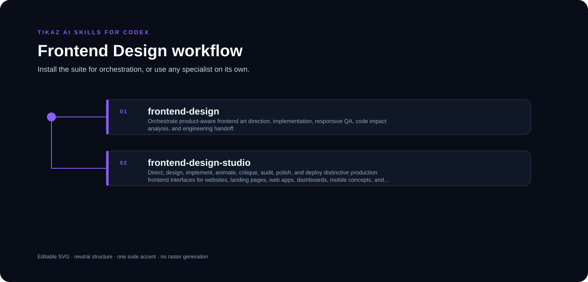

<p align="center"><a href="README.md">English</a> · <strong>简体中文</strong></p>

<p align="center"></p>

# TIKAZ Frontend Design for Codex

**先证明视觉方向，再扩大前端实现的产品设计工作流。**

由 **TIKAZ** 主导设计、整合、独立重构和持续维护。本项目面向兼容 Codex Skill 的宿主，并非 OpenAI 官方项目。


<p align="center"></p>

## ✨ 为什么不同

- 先把界面归为 `Persuade`、`Operate`、`Read` 或 `Experience`，避免所有产品都做成落地页。
- 实现前明确 Design Read、视觉差异度、动效强度和信息密度。
- 先验证导航、首屏、一个代表性下游区域，以及桌面与移动端方向样板。

## 🧩 可以单独使用的 Skill

| Skill | 角色 | 用途 |
|---|---|---|
| [`frontend-design`](https://tikazi.github.io/TIKAZ-AI-Skills/zh/skills/frontend-design/index.html) | 编排器 | 从产品分类、视觉方向到工程移交的完整流程 |
| [`frontend-design-studio`](https://tikazi.github.io/TIKAZ-AI-Skills/zh/skills/frontend-design-studio/index.html) | 专业 Skill | 独立完成设计、实现、动效、审查、打磨与浏览器 QA |

## 🚀 示例

```text
使用 frontend-design-studio 重做这个运营后台。
先给出桌面端和移动端代表性样板，确认后再扩展整套界面。
```

## 📦 安装

```powershell
Copy-Item -Recurse `
  -LiteralPath '.\suites\frontend-design\frontend-design-studio' `
  -Destination '.\.agents\skills\frontend-design-studio'
```

## ⚠️ 限制

- 设计确认不等于运行时验证，必须提供目标视口的截图或渲染证据。
- 浏览器、组件库和部署工具必须在使用前确认当前环境确实可用。
- 除非用户明确授权，不改变现有路由、分析事件、可访问性和法律文案。

来源与贡献边界见 [SOURCES.yml](SOURCES.yml) 与 [THIRD_PARTY_NOTICES.md](THIRD_PARTY_NOTICES.md)。

## 🌐 探索 TIKAZ 工作流家族

[🏠 AI Skills](https://github.com/TIKAZI/TIKAZ-AI-Skills) · [⚡ Context Economy](https://github.com/TIKAZI/TIKAZ-Codex-Context-Economy) · [🎨 Frontend Design](https://github.com/TIKAZI/TIKAZ-Codex-Frontend-Design) · [🎬 Video Intelligence](https://github.com/TIKAZI/TIKAZ-Codex-Video-Intelligence) · [🛠️ Engineering](https://github.com/TIKAZI/TIKAZ-Codex-Engineering) · [🔬 Research](https://github.com/TIKAZI/TIKAZ-Codex-Knowledge-Research) · [📽️ Presentation](https://github.com/TIKAZI/TIKAZ-Codex-Presentation) · [🖼️ Visual Content](https://github.com/TIKAZI/TIKAZ-Codex-Visual-Content)
